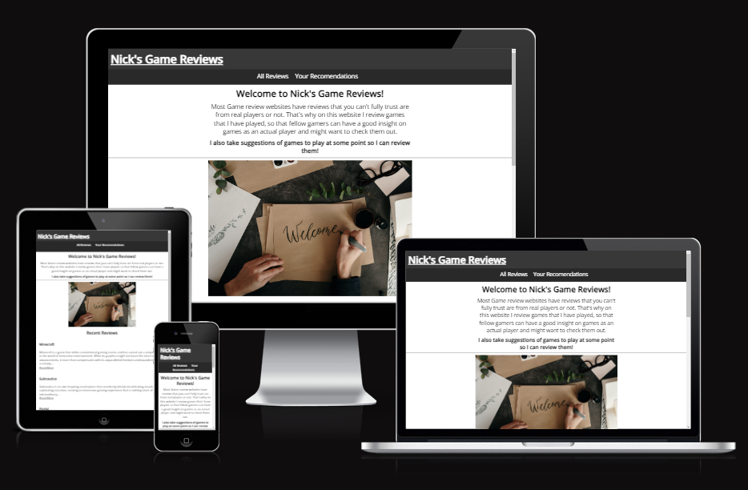
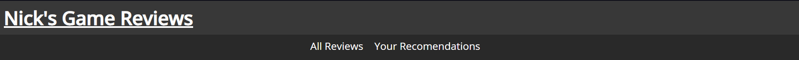
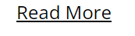
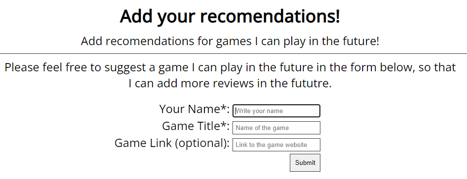

# Welcome to Nick's Game Reviews!

This is a website created as a review website for games I have played. It is targeted towards people who play games who want to see game reviews by people who usually play games. Compared to other websites where the reviews are created where it is usually people who reviewed others playing the games.

  
__Image created using__ [Am I responsive](https://ui.dev/amiresponsive?url=https%3A%2F%2Fbytes.dev)

----------

## Features

### Navigation:

  
The navigation bar consists of the logo, and two other links. Which all take you to corresponding pages on the website. When clicking on the two links, a line appears to show which page the user is on. This is a simple and practical design, as it is not to cluttered and is an easy and responsive design.

### Read more:

  
The home page has a recently reviewed section, which shows three small paragraphs of the three most recent games I have reviewed. These also contain a "Read More" link that takes you too the corresponding review on the All reviews page. This allows the user to be more engaged with the website and is an easy way for the user to find the reviews they want to see.

### Submision form:

  
The website contains a form in which the user can submit a game they wish for me to play and then review in the future. The user can write a name (does not have to be their real name), and then write the name of a game I should play. These are required to submit the form. The user can also submit a link to the website where I could get the game. This allows the user to be engaged in what games can be reviewed, and if they wish to see a review about a game they like. Which allows other people to find games they like.

### Footer:

  
The footer contains a message that encourages the user to play these games if they sound interesting enough. It also contains two links that open in a new tab. One link leads the user to steam, which is a well known marketplace for games and contains alot of games. Another link leads to google, since in the case the game does not exist on steam, this would be an easy and user friendly way to let the user try to find it themselves.

### Possible features:

* Automatic updating of the recent reviews page. When a new review is added to the All reviews page, it gets added to the top of the Recent reviews section and older reviews get removed.

----------

## Testing

### Browser testing:

The website has been tested on different web browsers such ass oprah, chrome, edge etc. The website is responsive and the website looks the same and functions the same on all of them.

### Validator testing:

* HTML
  * [W3C validator](https://validator.w3.org/nu/?doc=https%3A%2F%2Fbricboi.github.io%2FNick-s-Game-Reviews%2F)
* CSS
  * [CSS Validator](https://codebeautify.org/cssvalidate#)

### Bugs:

* ~~"Read More" links do not work properly~~
* Navigation bar is not fully responsive for phone sizes 

### Fixed bugs:

* "Read More" links now take you to the corresponding review

----------

## Deployment

* The deployment process was as follows using GitHub pages:
  * Navigate to the settings tab in Github Repository and click pages
  * Select branch and click main
  * Press save and the Site becomes live [Nick's Game Reviews link](https://bricboi.github.io/Nick-s-Game-Reviews/)
